### **Kreeda-Prerana Scout: Executive Overview**

**The Objective**
Kreeda-Prerana Scout is a modern, enterprise-grade Android application designed to digitize athletic scouting. It replaces traditional pen-and-paper tracking by providing coaches and scouts with a centralized platform to manage athlete profiles, log trial performances in real-time, and visualize talent progression over time.

**Core Modules & Capabilities**

**1. Comprehensive Roster Management**

* **Dynamic Profiles:** Coaches can register athletes with detailed metadata, including Roll Number, Age, Class, School, and Primary Sport.
* **Media Integration:** Secure profile picture capture using the device camera or local gallery, saved directly to the app's internal storage.
* **Real-Time Discovery:** A reactive search engine allows scouts to instantly filter the athlete roster by name or sport.

**2. Precision Trial Logging**

* **Event-Specific Interfaces:** The logging engine adapts its UI based on the sport. Track events feature a custom-built circular sweeping stopwatch (00:00.00 format), while field events (like Jumps and Throws) offer precise decimal-based manual entry.
* **Data Integrity:** Includes a built-in "Undo" architecture to safely erase accidental trial logs without corrupting the database.

**3. Performance Analytics (Talent Curve)**

* **Data Visualization:** Integrates `MPAndroidChart` to plot historical trial data on an interactive, swipeable line graph.
* **Trend Tracking:** Automatically groups and filters an athlete’s history by event type (e.g., viewing only the progression of their 100m sprint times), allowing scouts to easily identify peaks, slumps, and overall trajectory.

**4. Gamification & Exporting**

* **Performance Cards:** The app acts as a digital trading card generator. It mathematically scans the database to find personal records (PRs) and assigns gamified badges (like "Rising Star" or "U-17 Elite") based on performance thresholds.
* **Secure Sharing:** Utilizes `PixelCopy` and Android's `FileProvider` to take an exact, cropped snapshot of the profile card, allowing scouts to seamlessly share an athlete's stats via WhatsApp or Email directly from the app.

**Technical Architecture**
The application is built entirely in **Kotlin** utilizing a modern **MVVM (Model-View-ViewModel)** architecture. The UI is constructed using **Jetpack Compose** (Material Design 3), ensuring a responsive, state-driven interface that seamlessly supports system-wide Dark Mode. Data persistence is handled offline via a robust **Room Database (SQLite)** utilizing Coroutines and Flow for reactive, asynchronous updates.


# Kreeda-Prerana Scout 

An enterprise-grade Android application designed for sports coaches, scouts, and athletic academies to seamlessly manage athlete profiles, log trial performances, and visualize talent progression. 

Developed entirely in Kotlin using modern Jetpack Compose architecture, this application acts as a digital scouting notebook with real-time performance analytics.

## Key Features

* **Comprehensive Athlete Management:** * Register athletes with custom fields (Name, Roll Number, Age, Class, School, Primary Sport).
    * Secure local image capture and gallery selection for profile pictures.
    * Full profile editing and archiving capabilities.
* **Dynamic Dashboard & Search:** * Real-time search filtering by athlete name or sport.
    * System-integrated Dark Mode and Light Mode toggle.
* **Precision Trial Logger:**
    * **Track Events:** Built-in custom circular stopwatch UI for accurate sprint timing (00:00.00 format).
    * **Field Events:** Manual decimal-based distance logging for jumps and throws.
    * **Smart Undo:** Instantly revert accidental trial logs.
* **Talent Curve Visualization:** * Interactive, swipeable line graphs powered by MPAndroidChart.
    * Dynamically filters performance trends based on specific sports events over time.
* **Shareable Performance Cards:** * Auto-generated, beautifully formatted athlete statistic cards.
    * Calculates top records and assigns gamified performance badges (e.g., "Rising Star", "U-17 Elite").
    * Custom exact-crop image generation via `PixelCopy` for seamless sharing to WhatsApp, Email, or scouts.

## Tech Stack & Architecture

* **Language:** Kotlin
* **UI Toolkit:** Jetpack Compose (Material Design 3)
* **Architecture:** MVVM (Model-View-ViewModel)
* **Database:** Room Persistence Library (SQLite) with Coroutines & Flow for reactive UI updates
* **Image Processing:** Coil (Async Image Loading), Android `FileProvider` (Secure Image Sharing)
* **Data Visualization:** MPAndroidChart via `AndroidView` interoperability

## Installation & Setup

1. Clone this repository to your local machine.
2. Open the project in **Android Studio (Jellyfish or newer recommended)**.
3. Ensure you have the JitPack repository added to your `settings.gradle.kts`:
```kotlin
   dependencyResolutionManagement {
       repositoriesMode.set(RepositoriesMode.FAIL_ON_PROJECT_REPOS)
       repositories {
           google()
           mavenCentral()
           maven { url = uri("[https://jitpack.io](https://jitpack.io)") }
       }
   }

```

4. Sync the Gradle files to download the required dependencies (Room, Coil, MPAndroidChart).
5. Build and run the application on an Android Emulator or a physical device running Android 8.0 (API 26) or higher.

## Screenshots

<div style="overflow-x:auto">
  <table>
    <tbody>
      <tr>
        <td>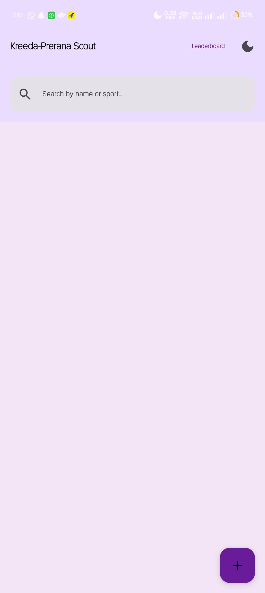</td>
        <td>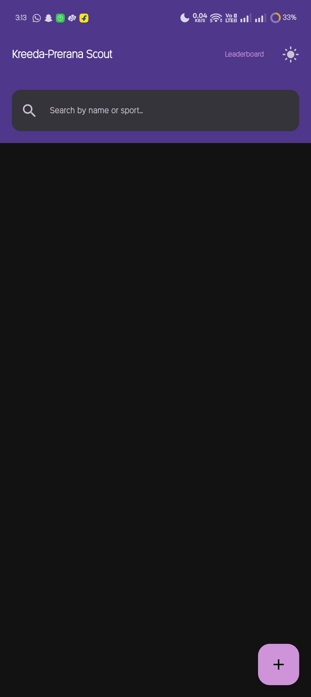</td>
      </tr>
      <tr>
        <td>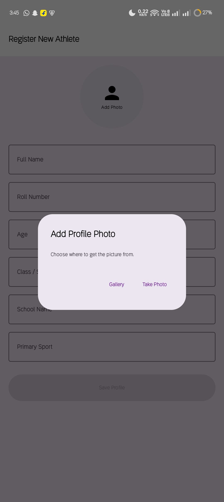</td>
        <td>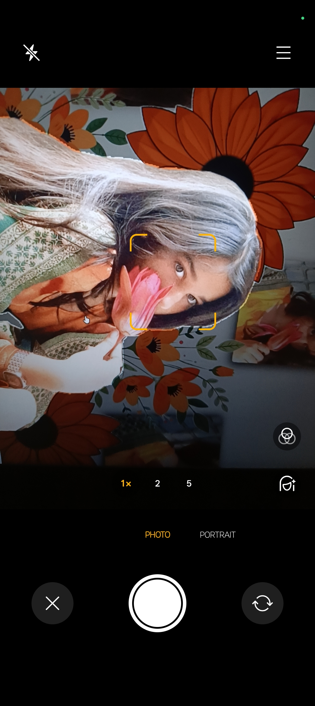</td>
        <td>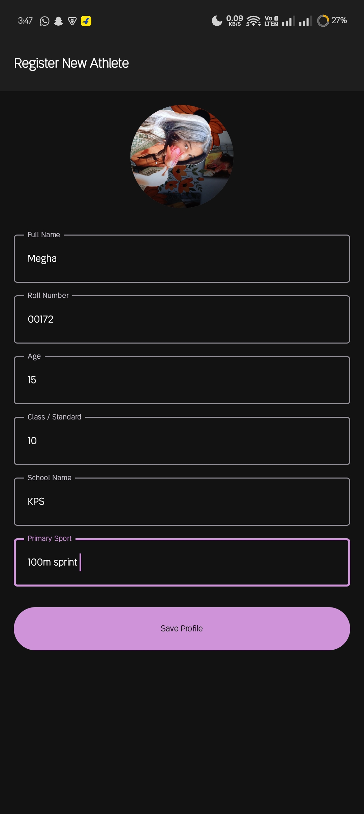</td>
        <td>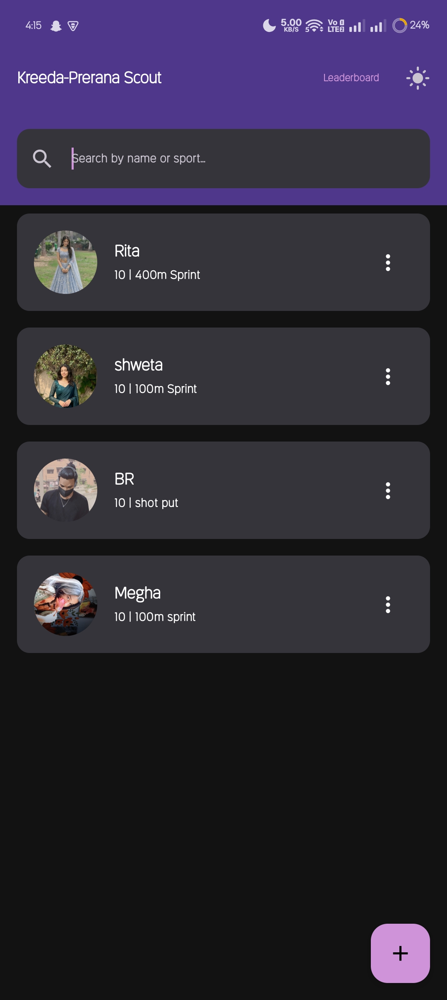</td>
      </tr>
      <tr>
        <td>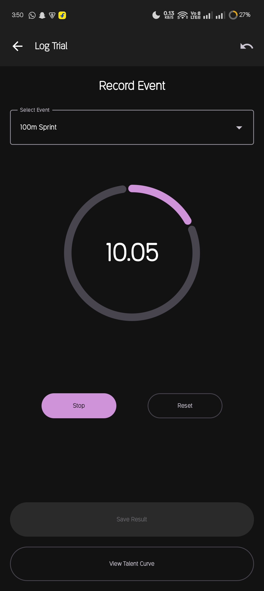</td>
        <td>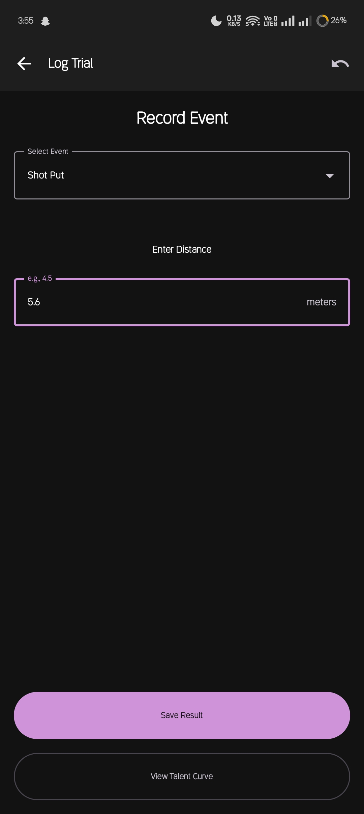</td>
        <td>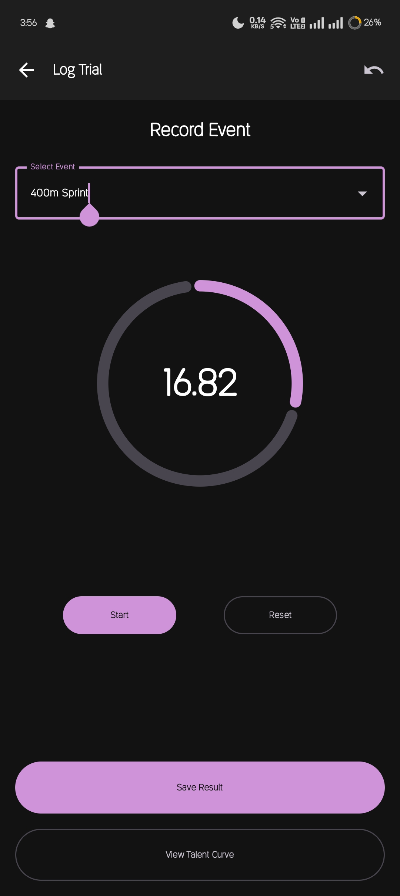</td>
      </tr>
      <tr>
        <td>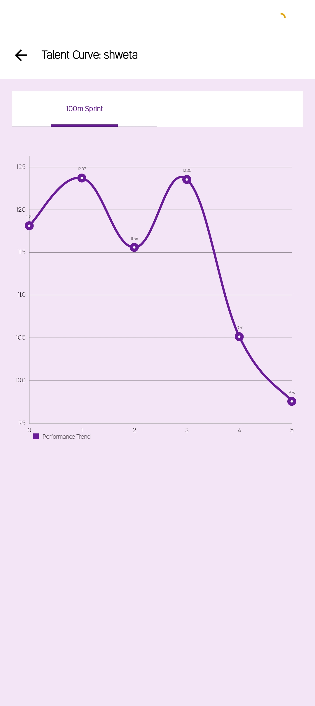</td>
        <td>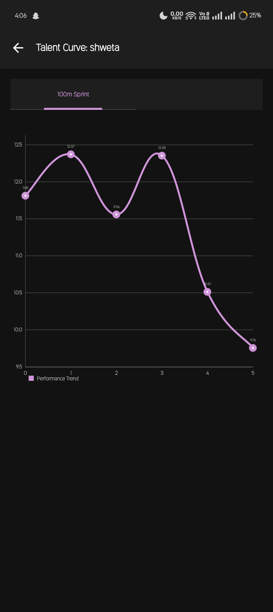</td>
      </tr>
      <tr>
        <td>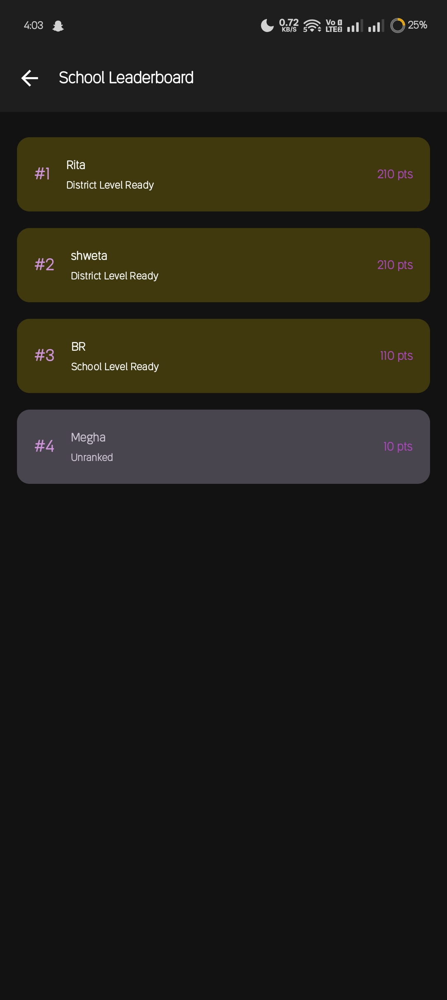</td>
        <td>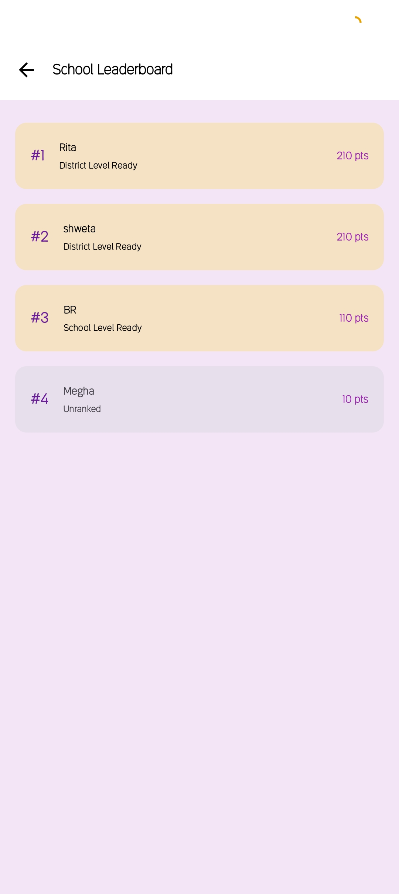</td>
      </tr>
      <tr>
        <td>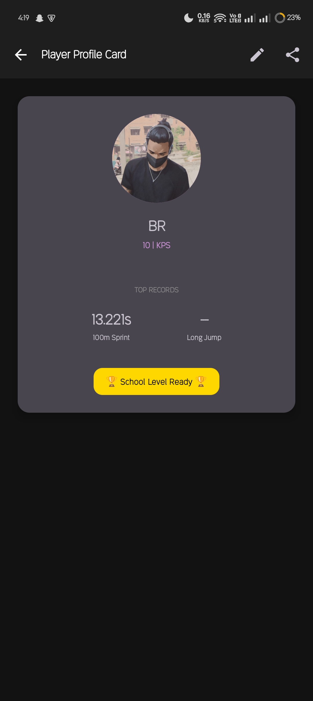</td>
        <td>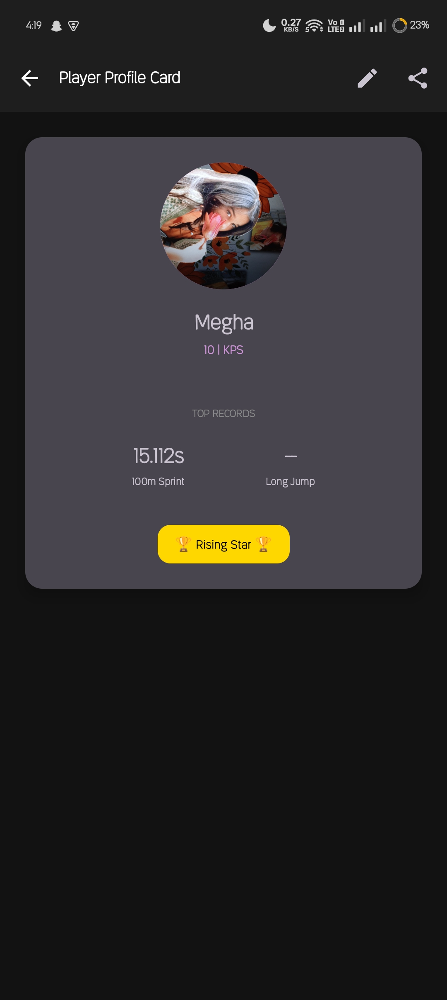</td>
      </tr>
    </tbody>
  </table>
</div>


<a href="https://drive.google.com/file/d/1H7o_Ec3MGZDNMXPKZYy9gsRgmMFAIzRX/view?usp=drive_link" target="_self">
  
</a>


**Developed by:** Sundar S.
